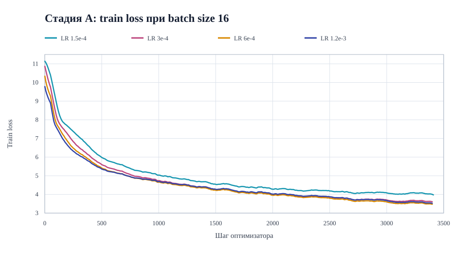
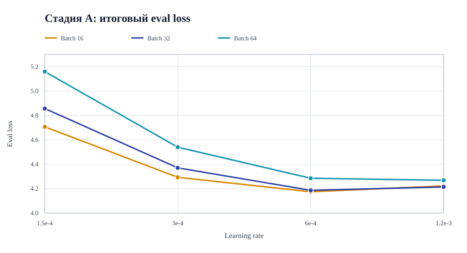
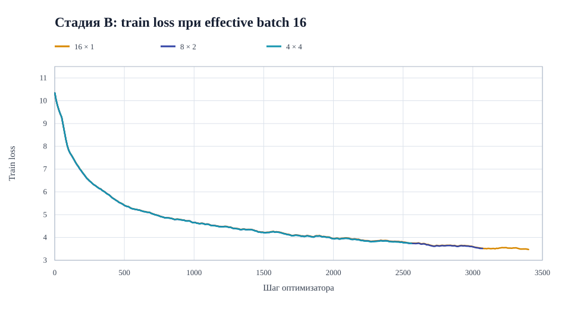
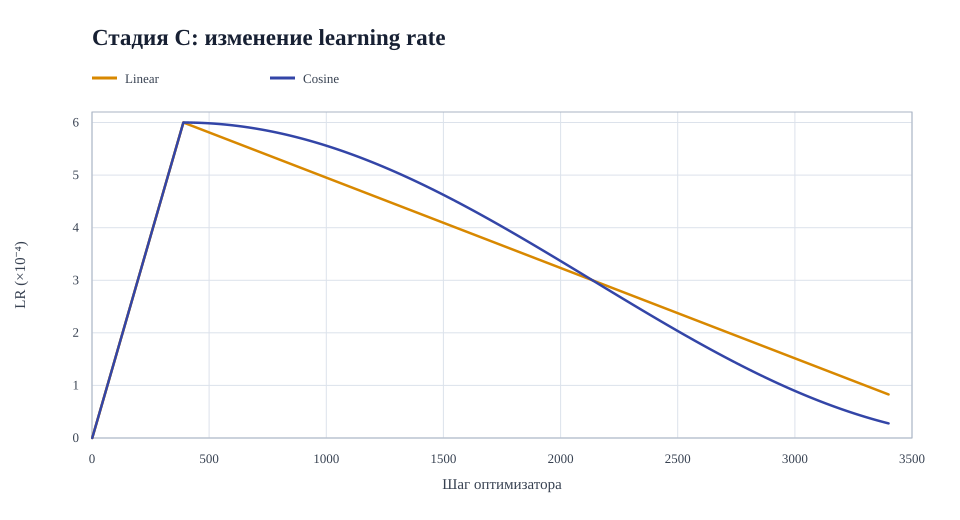
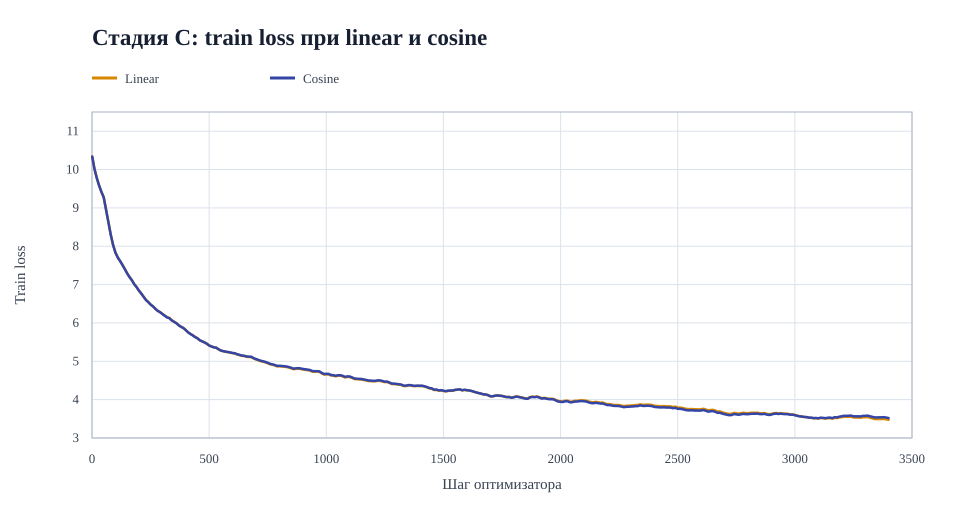
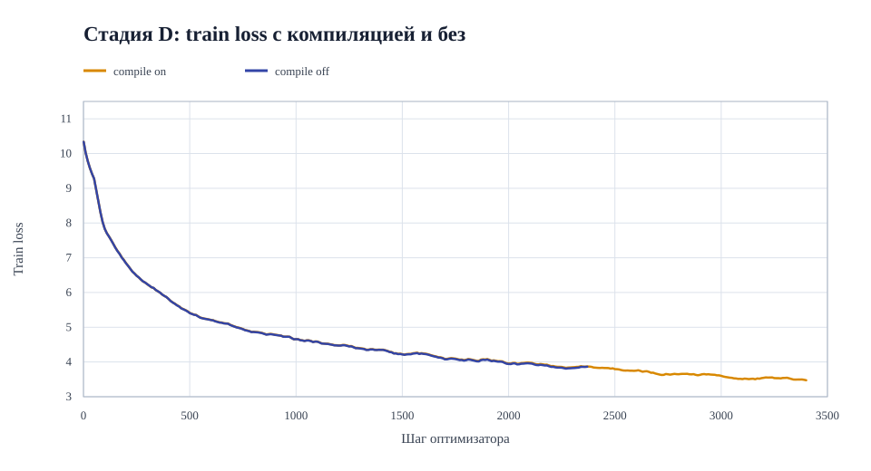
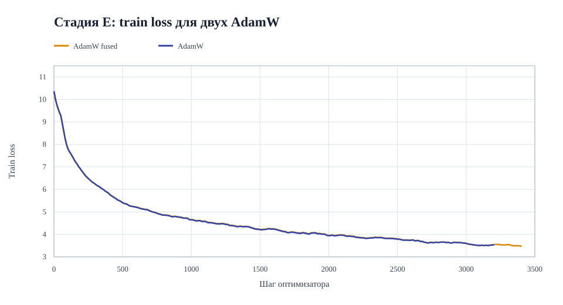
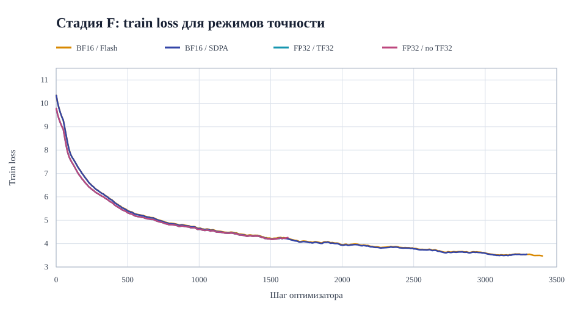

# Мини-претрейн Qwen3 на русской Википедии

## 1. Задача и протокол

Цель — обучить языковую модель с нуля за 15 минут на одной NVIDIA A100 80 GB и сравнить настройки обучения по итоговому `eval_loss`. Код подготовки данных и обучения находится в [your_solution.py](your_solution.py), конфигурации экспериментов — в [experiment_configs.py](experiment_configs.py).

- **Данные:** `wikimedia/wikipedia`, конфигурация `20231101.ru`, split `train` (1 945 063 записи). Первые 5 000 записей в исходном порядке — validation; остальные 1 940 063 — train. Разделение одинаково во всех запусках.
- **Токенизация:** `ai-forever/rugpt3small_based_on_gpt2`. Каждый текст обрезается или дополняется до 512 токенов.
- **Модель:** `Qwen3ForCausalLM`, случайная инициализация, 960 881 664 параметра.
- **Бюджет:** обучение останавливается `TimeoutCallback` после 900 секунд; финальная оценка на всех 5 000 validation-записях выполняется отдельно.

Основная метрика — `eval_loss`; perplexity привожу как дополнительный показатель. Во всех экспериментах используется seed 42.

## 2. Подготовка и контрольные измерения

Перед основными запусками я проверил, какие размеры microbatch помещаются на GPU и сколько токенов обрабатывается за секунду. Каждый [batch-probe](results/batch-probes/) выполнял 5 шагов с `gradient_accumulation_steps=1`, BF16, TF32 и `torch_compile=True`. Скорость рассчитана по медианному времени шага **после первого шага** для фиксированной длины 512. Это короткий технический тест, а не 15-минутное сравнение качества.

| Microbatch | Токенов/с | Пиковая зарезервированная GPU-память | Результат |
| ---: | ---: | ---: | :--- |
| 4 | 23 588 | 8,8 GiB | успешно |
| 8 | 25 958 | 11,7 GiB | успешно |
| 16 | 29 745 | 18,0 GiB | успешно |
| 32 | 32 641 | 34,0 GiB | успешно |
| 64 | 34 123 | 59,5 GiB | успешно |
| 80 | 33 910 | 73,6 GiB | успешно |
| 96 | — | — | CUDA OOM |

Для основной сетки я выбрал microbatch 16, 32 и 64: это три масштаба для изучения влияния batch size. Размер 80 не дал прироста скорости относительно 64 и оставил меньший запас памяти; 96 не поместился.

Отдельно я оценил [модель до обучения](results/untrained/summary.json) на том же validation-наборе: `eval_loss = 11,2178`, perplexity `≈ 74 444`. Это исходная точка для сравнения с результатами претрейна.

## 3. План экспериментов и критерии сравнения

Сначала я исследовал сетку batch size × learning rate (стадия A). Затем сравнивал изменения отдельных параметров с лучшей точкой сетки: microbatch 16, `gradient_accumulation_steps=1`, learning rate `6·10⁻⁴`. Во всех основных запусках лимит обучения составлял 900 секунд, использовались одинаковые данные и seed 42. Общая конфигурация: линейный scheduler, `adamw_torch_fused`, `torch_compile=True`, BF16, TF32, FlashAttention 2; исключения указаны ниже.

| Стадия | Что менял | Гипотеза и способ проверки |
| :--- | :--- | :--- |
| A | Microbatch 16/32/64 × learning rate `1,5·10⁻⁴`, `3·10⁻⁴`, `6·10⁻⁴`, затем `1,2·10⁻³`; accumulation = 1 | Большой batch может повысить пропускную способность и снизить шум градиента, но за 15 минут даст меньше обновлений весов. Малый LR может не успеть обучить модель, слишком большой — ухудшить стабильность. Полная сетка показывает, зависит ли удачный LR от batch size. |
| B | `16×1`, `8×2`, `4×4` | Effective batch везде 16, но накопление градиентов требует больше последовательных проходов через модель на одно обновление. Проверяю, сколько шагов теряется на этом и меняется ли `eval_loss`. |
| C | `linear` против `cosine` | Разная форма снижения LR может изменить скорость обучения к концу запуска. Проверяю, даст ли cosine меньший финальный loss при тех же остальных настройках. |
| D | `torch_compile=True` против `False` | Компиляция требует времени в начале, но может ускорить последующие шаги. Проверяю, окупается ли она в пределах 15 минут. |
| E | `adamw_torch_fused` против `adamw_torch` | Fused-реализация может уменьшить накладные расходы шага оптимизатора; сравниваю число шагов и качество за одинаковое время. |
| F | BF16 + SDPA, FP32 + SDPA с TF32 on/off; сравнение BF16 + SDPA с BF16 + FlashAttention 2 | BF16 может ускорить обучение ценой меньшей точности вычислений; TF32 ускоряет матричные операции FP32, но тоже меняет их точность. Общий backend SDPA позволяет сравнить режимы точности без подмены эффекта сменой attention. Пара BF16 + SDPA/FlashAttention отдельно проверяет backend. |

Главный критерий — **финальный `eval_loss`** на фиксированном validation-наборе. Дополнительно я сравниваю perplexity, кривые train loss и число шагов. При фиксированном времени быстрые настройки успевают сделать больше обновлений весов: различие `eval_loss` отражает и свойства метода, и его скорость.

Для scheduler Trainer заранее рассчитывает, на сколько шагов растянуть изменение learning rate. Если задать целую эпоху, график окажется рассчитан почти на весь датасет и за 15 минут пройдёт лишь небольшую его часть. Поэтому я указал `num_train_epochs=0,032`: это приблизило график learning rate к длительности запуска. **Обучение всё равно останавливает таймер**, а не эта настройка. Первые 10% запланированных шагов отвёл под warmup — плавный рост learning rate в начале обучения с нуля.

## 4. Генерации: контроль до обучения

Для каждой модели я использовал одни и те же промпты:

1. «Искусственный интеллект — это область информатики, которая»
2. «Москва — столица России. Город расположен»
3. «Однажды зимним вечером маленький мальчик»

На каждый промпт сохранял два продолжения длиной до 64 новых токенов: жадное (`greedy`) и сэмплированное (`temperature=0,8`, `top_p=0,95`, `repetition_penalty=1,1`, seed 42). Полные ответы необученной модели находятся в [generations.json](results/untrained/generations.json). Они не продолжают тему промпта: вместо связного текста идут случайные фрагменты русских и английских слов, например начало жадного ответа на первый промпт — «Сол развер разрешили шкале нелеп 1000…». Это ожидаемая отправная точка для модели со случайными весами; после обучения я сравниваю генерации с ней при тех же промптах и настройках декодирования.

## 5. Стадия A — batch size × learning rate

Сначала я проверил сетку 3 × 3, затем добавил четвёртое, более высокое значение LR для каждого batch size: на первоначальной сетке лучший результат находился у её верхней границы (`6·10⁻⁴`). Во всех 12 запусках `gradient_accumulation_steps=1`; прочие настройки описаны выше. Ниже — итог после 15 минут обучения; названия запусков ведут к сохранённым метрикам.

| Запуск | Batch | LR | Шаги | `eval_loss` | Perplexity |
| :--- | ---: | ---: | ---: | ---: | ---: |
| [b16, 1,5e-4](results/grid_b16_lr1p5e4/summary.json) | 16 | 1,5e-4 | 3 411 | 4,7073 | 110,75 |
| [b16, 3e-4](results/grid_b16_lr3e4/summary.json) | 16 | 3e-4 | 3 407 | 4,2934 | 73,22 |
| [b16, 6e-4](results/grid_b16_lr6e4/summary.json) | 16 | 6e-4 | 3 404 | **4,1749** | **65,03** |
| [b16, 1,2e-3](results/grid_b16_lr1p2e3/summary.json) | 16 | 1,2e-3 | 3 405 | 4,2232 | 68,25 |
| [b32, 1,5e-4](results/grid_b32_lr1p5e4/summary.json) | 32 | 1,5e-4 | 1 820 | 4,8571 | 128,65 |
| [b32, 3e-4](results/grid_b32_lr3e4/summary.json) | 32 | 3e-4 | 1 828 | 4,3710 | 79,12 |
| [b32, 6e-4](results/grid_b32_lr6e4/summary.json) | 32 | 6e-4 | 1 826 | 4,1866 | 65,80 |
| [b32, 1,2e-3](results/grid_b32_lr1p2e3/summary.json) | 32 | 1,2e-3 | 1 826 | 4,2149 | 67,69 |
| [b64, 1,5e-4](results/grid_b64_lr1p5e4/summary.json) | 64 | 1,5e-4 | 950 | 5,1596 | 174,09 |
| [b64, 3e-4](results/grid_b64_lr3e4/summary.json) | 64 | 3e-4 | 952 | 4,5404 | 93,72 |
| [b64, 6e-4](results/grid_b64_lr6e4/summary.json) | 64 | 6e-4 | 951 | 4,2855 | 72,64 |
| [b64, 1,2e-3](results/grid_b64_lr1p2e3/summary.json) | 64 | 1,2e-3 | 952 | 4,2690 | 71,45 |

Кривые показывают train loss при фиксированном batch 16; для читаемости использовано скользящее среднее по 11 записям лога

При увеличении LR от `1,5·10⁻⁴` до `6·10⁻⁴` `eval_loss` снизился при всех трёх batch size. Увеличение до `1,2·10⁻³` уже не улучшило результат для batch 16 и 32; при batch 64 выигрыш относительно `6·10⁻⁴` мал (4,2855 → 4,2690). Минимум всей сетки — **4,1749** у batch 16 и LR `6·10⁻⁴`; эту конфигурацию я использовал как основу следующих стадий. Хотя batch 64 показал наибольшую скорость в предварительной проверке, его `eval_loss` оказался выше. Разница между batch 16 и 32 при LR `6·10⁻⁴` невелика (0,0117), поэтому по одному запуску нельзя утверждать, что batch 16 всегда лучше. При этом у LR `1,2·10⁻³` train loss опускается ниже, чем у `6·10⁻⁴`, а validation loss выше: выбирать LR только по кривой обучения нельзя.

Генерации стали похожи на русский энциклопедический текст, но связность остаётся слабой. Например, после промпта о Москве у лучшего запуска текст начинается с «в центральной части города Москвы», затем появляется заголовок «История» и повторяется фраза «В 1764 году в составе Российской империи». Это заметный прогресс относительно случайных фрагментов необученной модели, но не надёжное продолжение по смыслу. Сэмплирование даёт более разнообразный текст, одновременно добавляя вымышленные детали. Полные ответы для сравнения: [низкий LR](results/grid_b16_lr1p5e4/generations.json), [лучший запуск](results/grid_b16_lr6e4/generations.json), [высокий LR](results/grid_b16_lr1p2e3/generations.json), [batch 64 при LR 6e-4](results/grid_b64_lr6e4/generations.json).

## 6. Стадия B — накопление градиентов

Я сравнил три способа получить один и тот же effective batch 16. LR (`6·10⁻⁴`) и остальные настройки взял у лучшего запуска стадии A

| Microbatch × accumulation | Шаги за 15 мин | `eval_loss` | Perplexity |
| :--- | ---: | ---: | ---: |
| [16 × 1](results/grid_b16_lr6e4/summary.json) | 3 404 | **4,1749** | **65,03** |
| [8 × 2](results/ga_b8x2/summary.json) | 3 070 | 4,2351 | 69,07 |
| [4 × 4](results/ga_b4x4/summary.json) | 2 566 | 4,3976 | 81,26 |

Все три кривые снижаются; для отображения использовано такое же сглаживание, как на графике стадии A. Но при большем накоплении за те же 15 минут выполняется меньше обновлений весов: на 10% меньше при `8×2` и на 25% меньше при `4×4` относительно `16×1`. Итоговый `eval_loss` при этом растёт. Поэтому в данном временном бюджете накопление не дало выигрыша. Это **не доказывает**, что оно само по себе ухудшает обучение при одинаковом числе шагов: здесь запуски успели пройти разное число шагов.

Генерации всех трёх моделей сохраняют энциклопедический стиль и характерные повторы. На промпте об искусственном интеллекте `8×2` многократно повторяет «В России», `4×4` — заголовок «Фамилия»; у `16×1` повторы тоже остаются. Я не вижу по этим примерам качественного преимущества накопления градиентов. Полные ответы: [16×1](results/grid_b16_lr6e4/generations.json), [8×2](results/ga_b8x2/generations.json), [4×4](results/ga_b4x4/generations.json).

## 7. Стадия C — scheduler

При batch 16, накоплении 1 и LR `6·10⁻⁴` я заменил только scheduler: `linear` на `cosine`. Базовый запуск уже был получен на стадии A.

| Scheduler | Шаги за 15 мин | `eval_loss` | Perplexity |
| :--- | ---: | ---: | ---: |
| [Linear](results/grid_b16_lr6e4/summary.json) | 3 404 | **4,1749** | **65,03** |
| [Cosine](results/scheduler_cosine/summary.json) | 3 408 | 4,2275 | 68,55 |

Число шагов практически одинаково, поэтому разница в скорости здесь не объясняет результат. Cosine снижает LR сильнее к концу запуска, но финальный `eval_loss` оказался выше на 0,0527. В этих условиях я оставил linear; одного запуска на вариант недостаточно для общего вывода о превосходстве scheduler.

Генерации качественно близки: обе модели используют энциклопедические заголовки и повторяют фразы. У cosine после промпта о Москве жадное продолжение помещает город «в городе Уссурий», затем зацикливается на «в ходе Второй мировой войны». У linear тоже есть повторы, так что по нескольким коротким примерам нельзя надёжно ранжировать два scheduler. Полные ответы: [linear](results/grid_b16_lr6e4/generations.json), [cosine](results/scheduler_cosine/generations.json).

## 8. Стадия D — `torch_compile`

Я отключил `torch_compile`, оставив остальные настройки базового запуска неизменными. Оба варианта обучались 15 минут.

| `torch_compile` | Шаги за 15 мин | `eval_loss` | Perplexity |
| :--- | ---: | ---: | ---: |
| [Включён](results/grid_b16_lr6e4/summary.json) | 3 404 | **4,1749** | **65,03** |
| [Выключен](results/compile_off/summary.json) | 2 374 | 4,4715 | 87,49 |

Кривые train loss близки на общих шагах, но с компиляцией за тот же срок удалось выполнить на **43% больше обновлений весов**. Поэтому, несмотря на затраты времени в начале, `torch_compile` окупился в этом запуске: финальный `eval_loss` ниже на 0,2967. График построен по шагам, а выигрыш по скорости виден из их итогового числа в таблице.

В обоих [вариантах с компиляцией](results/grid_b16_lr6e4/generations.json) и [без неё](results/compile_off/generations.json) текст приобретает энциклопедическую форму, но уходит от исходного смысла промптов. Например, после фразы о Москве запуск без компиляции переходит к описанию географии посёлка. По отдельным генерациям различие качества неочевидно; основной аргумент здесь — `eval_loss` на всём validation-наборе.

## 9. Стадия E — оптимизатор

Я сравнил две реализации AdamW при тех же batch 16, LR `6·10⁻⁴` и остальных настройках. В `adamw_torch_fused` операции обновления весов объединены; проверка показывает, даёт ли это выигрыш за ограниченное время.

| Оптимизатор | Шаги за 15 мин | `eval_loss` | Perplexity |
| :--- | ---: | ---: | ---: |
| [AdamW fused](results/grid_b16_lr6e4/summary.json) | 3 404 | **4,1749** | **65,03** |
| [AdamW](results/optimizer_unfused/summary.json) | 3 200 | 4,2097 | 67,34 |

Кривые train loss близки, но fused-версия успела сделать примерно на **6% больше шагов** и получила `eval_loss` ниже на 0,0349. Разница намного меньше, чем в сравнении с выключенной компиляцией. В 15-минутном бюджете fused AdamW оказался предпочтительнее, хотя одного запуска недостаточно, чтобы уверенно отделить эффект скорости от случайного разброса качества.

Оба варианта в генерациях по-прежнему повторяются и ошибаются в содержании. Например, без fused-оптимизатора жадный ответ на промпт о Москве помещает её «в городе Джайн»; базовый запуск тоже генерирует недостоверную «Историю». Отдельные тексты не дают надёжного качественного различия. Полные ответы: [fused](results/grid_b16_lr6e4/generations.json), [обычный AdamW](results/optimizer_unfused/generations.json).

## 10. Стадия F — точность вычислений и attention

Для сравнения BF16 и FP32 я использовал один attention backend — SDPA. Внутри FP32 отдельно переключил TF32; влияние backend проверил сравнением двух запусков BF16. Batch 16, LR `6·10⁻⁴` и остальные настройки не менялись.

| Режим | Шаги за 15 мин | `eval_loss` | Perplexity |
| :--- | ---: | ---: | ---: |
| [BF16 + FlashAttention 2](results/grid_b16_lr6e4/summary.json) | 3 404 | **4,1749** | **65,03** |
| [BF16 + SDPA](results/precision_bf16_sdpa/summary.json) | 3 293 | 4,1803 | 65,39 |
| [FP32 + SDPA, TF32 on](results/precision_fp32_tf32/summary.json) | 1 583 | 4,8115 | 122,91 |
| [FP32 + SDPA, TF32 off](results/precision_fp32_no_tf32/summary.json) | 1 620 | 4,7999 | 121,50 |

При одинаковом SDPA вариант BF16 сделал за 15 минут примерно вдвое больше шагов, чем FP32, и получил значительно меньший `eval_loss` (4,1803 против 4,8115/4,7999). Это преимущество **в заданном временном бюджете**, а не доказательство, что BF16 точнее FP32 при одинаковом числе шагов. Для FP32 включение TF32 не дало измеримого выигрыша: разница между двумя результатами мала и не позволяет сделать уверенный вывод. При BF16 FlashAttention 2 немного быстрее SDPA (3 404 против 3 293 шагов), но разница в `eval_loss` всего 0,0055 — тоже слишком мала для сильного вывода по одному запуску.

В [BF16 + SDPA](results/precision_bf16_sdpa/generations.json) и двух FP32-запусках ([TF32 on](results/precision_fp32_tf32/generations.json), [TF32 off](results/precision_fp32_no_tf32/generations.json)) встречаются те же энциклопедические шаблоны, повторы и уход от промпта. Например, FP32 + TF32 повторяет «Ботаники-Бад», а FP32 без TF32 — «Отряд». Ни один режим пока не даёт устойчиво осмысленного продолжения.

## Итог

Лучший из проведённых запусков — [batch 16, LR `6·10⁻⁴`, linear scheduler, `torch_compile=True`, fused AdamW, BF16 и FlashAttention 2](results/grid_b16_lr6e4/summary.json): **`eval_loss = 4,1749`**, perplexity **65,03**. Модель научилась создавать русскоязычные фразы и структуру текста, но генерации остаются повторяющимися и часто не соответствуют промпту.

В пределах 15-минутного бюджета сильнее всего проявились выбор LR, компиляция и скорость BF16 относительно FP32. Накопление градиентов уменьшило число доступных обновлений; варианты scheduler, AdamW и attention backend дали меньшие различия.
